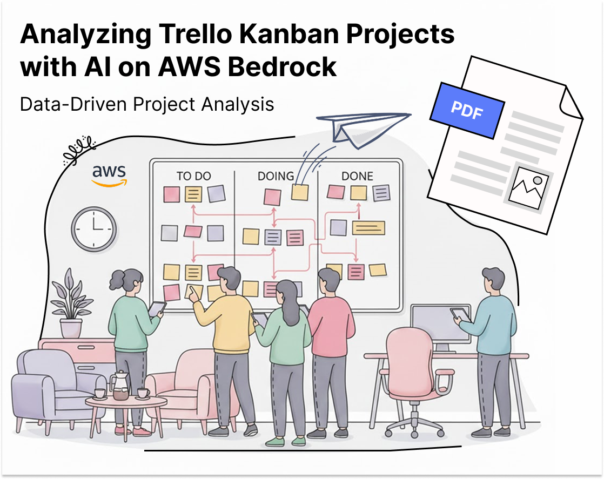

---

# 🏷️ Data-Driven Project Analysis: Analyzing Trello Kanban Projects with AI on AWS Bedrock

## Introduction

Modern software projects often involve multiple distributed teams working on high-complexity initiatives, with frequent releases and ongoing production fixes. While tools like Kanban boards help organize tasks, epics, and workflows, they also generate large volumes of unstructured data in the form of comments, status changes, and timelines.
As the number of interdependent tasks and contributors grows, understanding the real state of a project, and identifying early risks or bottlenecks, becomes increasingly difficult. Manual analysis is time-consuming and often subjective.

In this repository, I present a practical use case that leverages AWS services and generative AI to enhance project analysis and interpretation. By analyzing task metadata and detecting semantic patterns in comments (such as ambiguity, implicit dependencies, missing definitions, or scope creep) AI enables more objective insights, early warnings, and data-driven decision-making

---

## 🗂️ Folder Structure

The repository is organized around the artifacts stored and generated in Amazon S3 during the execution of the pipeline.

### 🪣 S3 Folder

**Trello-ai-tutorial/email_template/**
Contains the HTML template used as the email body when sending reports via Amazon SES. This template can be customized to match branding or communication preferences.

**Trello-ai-tutorial/prompt/**
Stores the prompt definition used to invoke the generative AI model. This file defines the analysis context, expected insights, and report structure, and can be iteratively refined to adapt the output to different project needs.

**output/YYYY-MM-DD/**
Contains the final generated reports, partitioned by execution date to facilitate traceability, auditing, and historical comparison

### 📑 Notebook: trello-project-analysis-ai.ipynb
Contains the Python notebook used by the AWS Glue job to execute the end-to-end project analysis pipeline. The notebook orchestrates the complete workflow, including data extraction from Trello, dataset enrichment, AI-based analysis using Amazon Bedrock, report generation, and automated email distribution.

--- 

# Reference Architecture
Before diving into the implementation details, it is useful to understand the overall architecture that supports this use case. The following reference architecture illustrates how project data flows from Trello through AWS services and into an AI-powered analysis pipeline.

The entire process is executed through an AWS Glue job implemented in Python, which orchestrates data extraction, transformation, AI inference, and report generation in a scalable and automated manner. 

At a high level, the architecture ingests Kanban project data from Trello, enriches it with temporal and contextual metadata, applies semantic analysis using generative AI models on AWS Bedrock, and produces structured, human-readable reports for project stakeholders.

 

----

### Core Components
#### 1. 📋Trello Integration Class
Connects to Trello boards via the Trello API
Retrieves boards, lists, and cards with enriched metadata
Calculates time-based metrics (e.g., days until due date)
Exports structured data to Amazon S3 in JSON format

#### 2. ✨AWS Bedrock Integration
Invokes the Amazon Nova model using custom prompts
Processes project datasets to generate semantic insights
Uses configurable inference parameters to balance cost and accuracy

#### 3.📊 Report Generation (MarkdownPDFReport)
Converts AI-generated markdown into professional PDF reports
Applies custom styling for readability and consistency
Supports tables, lists, and structured summaries

#### 4. Supporting Services
🔐AWS Secrets Manager: securely stores Trello API credentials
🪣Amazon S3: stores datasets, prompts, and generated reports
📩Amazon SES: distributes automated reports via email
